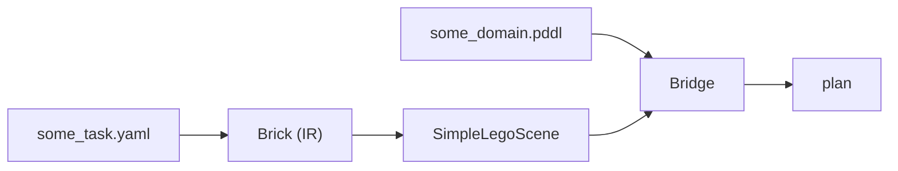

# Lego Workbenchmark


## Setup (TODO)

### TAMPanda

Install:
```bash
git clone https://github.com/snoato/TAMPanda.git
cd tampanda
pip install -e .
```
Now create symlink inside `src/`:
```bash
cd src
ln -s ../TAMPanda/tampanda .
```

### WorkBenchMark Dataset
In main repo folder (ie one folder level above src: `src\..`):
```bash
git clone https://github.com/WorkBenchMark/dataset.git
```
Now create symlink inside `src/`:
```bash
cd src
ln -s ../dataset .
```

### Lego Simulator (optional)
Only the pure-Python planner `executor_planner.py` is used (no ROS, no MuJoCo needed)
```bash
git clone https://github.com/ma-haha-hehe/lego_sim.git

cd lego-workbenchmark/src
ln -s ../../lego_sim/src/mj_bridge/mj_bridge mj_bridge   # For ABD baseline planner
```

### Fast-Downward (optional)
```bash
git clone https://github.com/aibasel/downward.git
cd downward
./build.py
```
Check whether `downward/fast-downward.py` exists.
To run solver, do
```bash
./<path-to-downwrad>/fast-downward.py path/to/pddl-domain.pddl path/to/problem.pddl --search "astar(blind())"
```

Example inside of `lego-workbenchmark`:
```bash
./downward/fast-downward.py src/domains/lego_coarse.pddl src/generated/problems_coarse/tier1/task_001.pddl --search "astar(blind())"
```


### Other
```bash
pip install pyyaml
```


---


## Project Structure (TODO)

### Overview


**For an example**, see this [notebook](src/lego_coarse_simple.ipynb).

### YAML Task Files
> see `src/dataset/ground_truth/tier[1,2]/task_*.yaml` 

Our input/problem: contains target structure and positions of a set of bricks.

### Brick
> see [src/yaml_loader.py](src/yaml_loader.py)

Internal representation of a brick in a specific yaml task (easier to work with than yaml dicts). Hence full yaml task is described by a list containing Brick objects.

### SimpleLegoScene
> see [src/scenes.py](src/scenes.py)

Sets up the [TAMPanda](https://github.com/snoato/TAMPanda) environment for a specific yaml task from its Brick representation. This involves adding the resources, putting the objects in their initial positions etc.
Additionally, it sets up the executor which allows us to control the arm in the TAMPanda environment (ie our env actions).
Also contains snap + welding logic (so TAMPanda blocks behave somewhat like Lego bricks).

### PDDL Domains
> see `src/domains/*.pddl` 

Each domain defines a state space graph: set of states and actions (deterministic state transitions) which are encoded via relational state abstraction:
- Defining objects of different types
- Possible relation types between those objects (predicates)
    - State is the current set of true relations
- Actions that change the current true relations
    - Hence actions transition to different states

### Bridge
> see [src/bridges.py](src/bridges.py)

Bridges 'link' the simulation environment (TAMPanda) to the symbolic state space graph (PDDL domain). They also build the goal condition (set of symbolic goal states).

As we want to plan in PDDL, we need to tell PDDL what our current asbtract symbolic state is from the TAMPanda environment (grounding).
From that state, PDDL gives us a plan (sequence of actions). Therefore we need to define what these abstract symbolic actions are actually supposed to do in the TAMPanda environment:
- state grounding (`bridge.predicate`): TAMPanda environment state to PDDL symbolic state
    - what relations hold between the objects
    - depends on what meaning you gave the predicates
    - or use `bridge.fluent` (initial value, then only changed by action effects => no re-sensing)
- action execution (` bridge.action` ): symbolic action to environment action
    - what is symbolic action supposed to do in real env


Let $s, s'$ be TAMPanda environemtn states and $t, t'$ PDDL symbolic states. Let *bridge* translate the symbolic action to a TAMPanda action and *ground* translate a TAMPanda state to a PDDL state:
```text

        a ────────── bridge ─────────▶ α


                       α
        s ───────────────────────────▶ s'
        │                               │
 ground │                               │ ground? (assumed)
        │                               │
        ▼                               ▼
        t ───────────────────────────▶ t'
                       a
```
We assume that after we execute an action $\alpha$ in our TAMPanda environment state $s$ that the new state we reach $s'$ still aligns with the symbolic state $t'$, but often that is not the case.
Eg when stacking a brick on a tower (the action being stack, the new state being the brick on the tower), the brick might slip while the symbolic state $t'$ represents a brick placed on a tower.
This is often solved with regrounding the state and replanning from there after each action execution. Or by defining a better environment action for the symbolic action.

### Using TamPanda for a LEGO Simulation Environment
Using TamPanda allowed for the reuse of multiple motion planning tools:
- `RRTStar` for the arm's motion planning
- `GraspPlanner` to generate candidate configurations for the gripper
- `PickPlaceExecutor` to query the `GraspPlanner` for a pose, then let `RRTStar` find  a plan to that pose and finally execute

With this motion planning framework at hand, it remains to initialize and adjust the environment such that it poses a plausible abstraction for a LEGO assembly. This includes spawning blocks at appropriate dimensions. Since the benchmark's initial ground truths do not include any obstructions, spawning the blocks, aligned and in a different, designated area again maintains equivalence to the original task. Similarly, we define our own assembly area.

Notably, our blocks do not have any studs, nor does our environment include a ground plate for the designated assembly area. Although such simplifications may seem detrimental, the environment still suffices the needs of engineering a PDDL Domain fit to the WorkBenchMark tasks: Since a solution is described with precise coordinates, there is no need to check stud-level alignment for blocks. Any valid goal only includes stackings that fulfil the alignments of studs, therefore we can make the abstraction from bricks that are stacked to blocks that are welded together. Since this is not default behaviour, [LegoCoarseSimpleV2SLSWeldBridge](src/bridges.py) includes a welding step that snaps a block to a "child", i.e. a block underneath or the table (corresponding to a ground plate). This must happen during the place action when the block is within close vicinity of its child, i.e., right when the gripper releases. If there were a need to pick blocks that are already stacked, the pick-action would require the removal of a weld. Realistically, there is no need since the tasks requires no such plans.

## Experiments and Results

### First Attempts
- where we didnt have simulation environment
- using quantifiers etc

### lego_coarse_simple.pddl and lego_coarse_simple_v2
- a simple constraint is that to place a brick any brick directly below it (supporter) must be placed
- this builds a supporter graph (specifically, directed acyclic graph)
- a valid brick placement order respecting the constraint is any topological sort of the DAG
- but one drawback is that stacked_on as defined in domain can only have one parent => next domain

### Going Beyond Tier 2: Vertical Precedence
##### **[Supporter Precedence](src/TODO)**
- allows us to define multiple supporters per brick
- tricks used and what problems they solve and their drawbacks:
    - filler bricks
    - supporter{i}


##### **[Layer Precedence](src/TODO)**
Another approach to solve precedence issues involves declaring an ordering of all possible height levels within the PDDL domain. We require two forms of bookkeeping per action: Which level are we at, and how many bricks are left at each level. Corresponding fluents must be defined at the initialization of the bridge. The planner starts at ground level, with the `remaining`-predicate specifying how many bricks are left to place at this level. To count down, we have to introduce a successor relationship `succ` for the type `num`. Once all bricks of a level are placed, the planner symbolically "opens" the next level. This solves any vertical precedence issues, but we remain susceptible to bricks obstructing each other at the same level.

#### Neighbor Precedence
There is always a possibility of bricks obstructing each other at the same height. For a grasp, the robot arm requires the target position to provide space on two opposing sides, i.e. either along the x-axis or y-axis. While some target configurations will always yield such issues no matter what plan, many such issues can be resolved if the right assembly order is chosen. Both the [Supporter Precedence](src/TODO) and the [Layer Precedence](src/TODO) approach can be adjusted to enforce placement of bricks only when one of the axes is free.

##### **[Neighbor Constraints](src/TODO)**
- new ordering constraint: brick can be placed iff no neighbor along a gripper axis is placed 


- [Layer Precedence_Axis_Aware](src/TODO)
To extend the layerwise-approach, again, pick-, place- and stack-actions must be split by axis so the planner can choose and consistently maintain the grasp orientation. Before we pick and place a block, the planner must verify that the target location is still neighborless for at least one axis. To this end, the bridge initializes neighbor-relations (`x-neighbor`/`y-neighbor`) between blocks' target locations, and initially equivalent checklist-relations (`x-to-be-checked`/`y-to-be-checked`), which are later falsified one-by-one by our check-actions (`check-x`/`check-y`). Since all checks must succeed right before picking and placing/stacking a block, it is important to precede the checks by a `select`-action. This is analogous to the layerwise precedence: Before, the planner counted down the number of blocks per layer before selecting the next one. Now we count down `x-checks-remaining`/`y-checks-remaining` before picking, placing/stacking and then selecting the next block, conveniently re-using the successor relationship `succ`.

Note (TODO): If we do not manage to complete these, I would still include at least the domains to show that such adjustment is logically feasible. 

### Comparison with ABD Baseline
In our [evaluation](src/eval_baseline.ipynb), we collect statistics on success rate and planning time. Notably, the ABD baseline, as stated in the paper, fails even at some level 1&2 tasks. This clearly showcases indicates our comparison underlies a caveat: Our work does not include perception but works with the simulation's ground truth, a simplification that saves both overhead in time as well as errors. Therefore, we run an ABD planner's recipe through our executors and observe equivalent outcomes, but found at much faster planning speed, taking roughly a hundredth of time on average. Overall, our pipeline yields a 100% success rate for planning and execution across tier 1 and 2 of the WorkBenchMark dataset.

## Limitations
Maybe some words on limitations (yea but more general like setup as domain-specific limitations already discussed)
- e.g. stacking on multiple bricks as happens in Tier 3&4 (unless we find a fix)
- also that our pipeline does no replanning, since we kinda don't need it atm
- 
## Conclusion and Outlook
- eg what can we say on the problem itself: it can be solved with PDDL in simplified sim env
- what it reduces to (layer/supporter/neighbor order constraints)
- ...