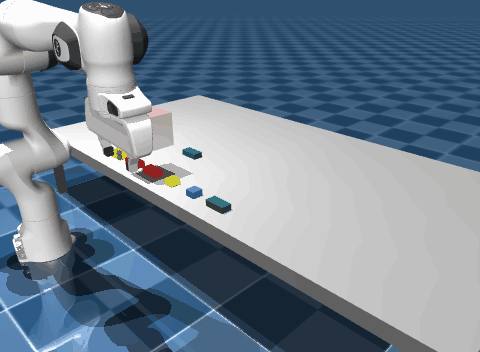
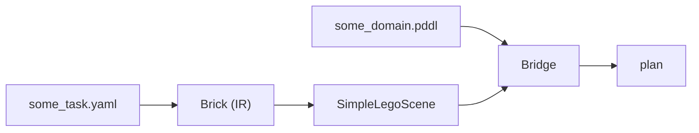

# Lego Workbenchmark



## 1. Installation

We worked usind no GPU and no ROS. Everything runs on the CPU

### 1.1 Python environment
```bash
git clone https://github.com/maxazv/lego-workbenchmark.git
cd lego-workbenchmark
python3.11 -m venv .venv
source .venv/bin/activate
pip install -r requirements.txt
```
`up_fast_downward` ships the Fast Downward binary; nothing has to be compiled.

### 1.2 External repositories
Three repositories are cloned next to this one and linked into `src/`. The links are ignored by git.
```bash
cd ..
git clone https://github.com/snoato/TAMPanda.git            # simulator + DomainBridge 
git clone https://github.com/WorkBenchMark/dataset.git      # the 400 benchmark tasks
git clone https://github.com/ma-haha-hehe/lego_sim.git       # only for the pure pyython ABD planner
pip install -e TAMPanda
cd lego-workbenchmark/src
ln -s ../../dataset dataset
ln -s ../../lego_sim/src/mj_bridge/mj_bridge mj_bridge
```

### 1.3 Check
From `src/`:
```bash
python -c "import tampanda, mujoco, unified_planning, mink; from mj_bridge.executor_planner import plan_assembly; print('ok')"
```

### 1.4 Quick start: one task, end to end
From `src/`. Plans tier 2 task 001 with the current domain, executes it in MuJoCo, scores it:
```bash
python eval.py --tasks tier2/task_001 --bridge simple_v2_welds --workers 1 --out ../results/quickstart.csv
```
The CSV has one row: `planned`, `plan_len`, `executed`, `goal_ok`, `max_dxy_mm`, `max_dyaw_deg`.
`goal_ok=True` means every brick ended within 6 mm / 6 deg of its target pose.

### 1.5 Reproduce the results
To reproduce the results we refer to the jupyter notebook [report.ipynb](src/report.ipynb).

<!---
All commands from `src/` 

| What | Command | Output | Time |
|---|---|---|---|
| PDDL problem files | `python generate_problems.py dataset tier1 coarse` (same for tier2, granular) | `generated/problems_*/` | seconds |
| Tier 1+2 sweep, simple_v2 domain | `python eval.py --tiers tier1 tier2 --bridge simple_v2_welds --workers 4 --out generated/evals/simple_v2_welds_t1t2.csv` | 200 rows  |
| All four tiers, slots domain | `python eval.py --tiers tier1 tier2 tier3 tier4 --bridge slots --workers 4 --out generated/evals/slots_t1234.csv` | 400 rows |
| ABD baseline vs PDDL, execution | `python run_eval.py --tiers 1 2 --every 5 --seed 42 --out ../results/execution_seed42.csv` | one row per task and planner |
| ABD baseline vs PDDL, tables and figure | open `eval_baseline.ipynb`, run all cells | `results/planning.csv`, `results/figures/` |

Committed results (seed 0 for `eval.py`, seed 42 for `run_eval.py`):

| Domain / evaluation | Tier 1 | Tier 2 | Tier 3 | Tier 4 | File |
|---|---|---|---|---|---|
| simple_v2 + welds, success | 100 % | 100 % | | | `src/generated/evals/simple_v2_welds_t1t2.csv` |
| slots + welds, success | 100 % | 100 % | 70 % | 27 % | `src/generated/evals/slots_t1234.csv` |
| ABD order through our executor, success | 100 % | 100 % | | | `results/execution_seed42.csv` |
| PDDL planning time per task | 0.05 s | 0.08 s | 0.08 s | 0.09 s | same files |
-->

### 1.6 Notebooks (read in order in the best case)
Start Jupyter from `src/` with the venv kernel: `cd src && python -m jupyterlab`

1. `report.ipynb`: results per domain, with some demos of some tasks
2. `lego_coarse_simple.ipynb`: the pipeline on a single task, step by step with renders: load task, build scene, plan, execute, score.
3. `beyond_tier2.ipynb`, `beyond_tier2_access.ipynb`: the tier 3 and 4 domains (multi-supporter slots, neighbour access) and their failure cases
4. `eval_baseline.ipynb`: comparison with the assembly by disassembly baseline, planning and execution, plus the published numbers
5. `analysis.ipynb`: dataset statistics that motivated the domain choices (bricks per task, supporters per brick)

`assembly.ipynb` and `assembly_blocks.ipynb` are early experiments kept for history; they are not needed to evaluate the project

### 1.7 Optional: Fast Downward from source
Only needed for `run_solver.py`, which calls the `fast-downward.py` script directly on the generated problem files
```bash
# clone and build
git clone https://github.com/aibasel/downward.git && cd downward && ./build.py
# then test-run with
./downward/fast-downward.py src/domains/lego_coarse.pddl src/generated/problems_coarse/tier1/task_001.pddl --search "astar(blind())"
```

---


## 2. Project Structure

### 2.1 Overview


### 2.2 YAML Task Files
> see `src/dataset/ground_truth/tier[1,2]/task_*.yaml` 

Our input/problem: contains target structure and positions of a set of bricks.

### 2.3 Brick
> see [src/yaml_loader.py](src/yaml_loader.py)

Internal representation of a brick in a specific yaml task (easier to work with than yaml dicts). Hence full yaml task is described by a list containing Brick objects.

### 2.4 SimpleLegoScene
> see [src/scenes.py](src/scenes.py)

Sets up the [TAMPanda](https://github.com/snoato/TAMPanda) environment for a specific yaml task from its Brick representation. This involves adding the resources, putting the objects in their initial positions etc.
Additionally, it sets up the executor which allows us to control the arm in the TAMPanda environment (ie our env actions).
Also contains snap + welding logic (so TAMPanda blocks behave somewhat like Lego bricks).

### 2.5 PDDL Domains
> see `src/domains/*.pddl` 

Each domain defines a state space graph: set of states and actions (deterministic state transitions) which are encoded via relational state abstraction:
- Defining objects of different types
- Possible relation types between those objects (predicates)
    - State is the current set of true relations
- Actions that change the current true relations
    - Hence actions transition to different states

In our usecase, PDDL serves as an abstraction of our simulation environment. Unrolling each possible trajectory using every possible action of a physics simulation is infeasible.
We thus represent what we suspect to be the most crucial aspects of the environment states/actions/effects with respect to the planning problem using PDDL domains (modeling).


### 2.6 Bridge
> see [src/bridges.py](src/bridges.py)

Bridges 'link' the simulation environment (TAMPanda) to the symbolic state space graph (PDDL domain). They also build the goal condition (set of symbolic goal states).

As we want to plan in PDDL, we need to tell PDDL what our current asbtract symbolic state is from the TAMPanda environment (grounding).
From that state, PDDL gives us a plan (sequence of actions). Therefore we need to define what these abstract symbolic actions are actually supposed to do in the TAMPanda environment:
- state grounding (`bridge.predicate`): TAMPanda environment state to PDDL symbolic state
    - what relations hold between the objects
    - depends on what meaning you gave the predicates
    - or use `bridge.fluent` (initial value, then only changed by action effects => no re-sensing)
- action execution (` bridge.action` ): symbolic action to environment action
    - what is symbolic action supposed to do in real env


Below is a diagram that visualizes that link between the simulation environment and its PDDL abstraction.
Let $s, s'$ be TAMPanda environemtn states and $t, t'$ PDDL symbolic states. Let *bridge* translate the symbolic action to a TAMPanda action and *ground* translate a TAMPanda state to a PDDL state:
```text

        a ────────── bridge ─────────▶ α


                       α
        s ───────────────────────────▶ s'
        │                               │
 ground │                               │ ground? (assumed)
        │                               │
        ▼                               ▼
        t ───────────────────────────▶ t'
                       a
```
We assume that after we execute an action $\alpha$ in our TAMPanda environment state $s$ that the new state we reach $s'$ still aligns with the symbolic state $t'$, but often that is not the case.
For example, when stacking a brick on a tower (the action being stack, the new state being the brick on the tower), the brick might slip while the symbolic state $t'$ represents a brick placed on a tower.
This is often solved with regrounding the state and replanning from there after each action execution. Or by defining a better environment action for the symbolic action.

### 2.7 Using TamPanda for a LEGO Simulation Environment
Using TamPanda allowed for the reuse of multiple motion planning tools:
- `RRTStar` for the arm's motion planning
- `GraspPlanner` to generate candidate configurations for the gripper
- `PickPlaceExecutor` to query the `GraspPlanner` for a pose, then let `RRTStar` find  a plan to that pose and finally execute

With this motion planning framework at hand, it remains to initialize and adjust the environment such that it poses a plausible abstraction for a LEGO assembly. This includes spawning blocks at appropriate dimensions. Since the benchmark's initial ground truths do not include any obstructions, spawning the blocks, aligned and in a different, designated area again maintains equivalence to the original task. Similarly, we define our own assembly area.

Notably, our blocks do not have any studs, nor does our environment include a ground plate for the designated assembly area. Although such simplifications may seem detrimental, the environment still suffices the needs of engineering a PDDL Domain fit to the WorkBenchMark tasks: Since a solution is described with precise coordinates, there is no need to check stud-level alignment for blocks. Any valid goal only includes stackings that fulfil the alignments of studs, therefore we can make the abstraction from bricks that are stacked to blocks that are welded together. Since this is not default behaviour, [LegoCoarseSimpleV2SLSWeldBridge](src/bridges.py) includes a welding step that snaps a block to a "child", i.e. a block underneath or the table (corresponding to a ground plate). This must happen during the place action when the block is within close vicinity of its child, i.e., right when the gripper releases. If there were a need to pick blocks that are already stacked, the pick-action would require the removal of a weld. Realistically, there is no need since the tasks requires no such plans.

## 3. Experiments and Results

In the following we give a "historical report" of our experiments and some results. Not every detail will be included but we tried to keep the repository as structured as possible without deleting any of our experiments.

### 3.1 First Attempts
- It didnt yet have a simulation environment and trying to figure out [lego_sim](https://github.com/ma-haha-hehe/lego_sim)
- used quantifiers and other more advanced PDDL operators etc (see [lego_coarse.pddl](src/domains/lego_coarse.pddl) and [lego_granular.pddl](src/domains/lego_granular.pddl))
- we assumed distractor blocks were present (not neccessary for assembly)
- identify blocks by their shape/color instead of name/id $\Rightarrow$ existential goal
- required us to plan using fast-downward
- omitted in next domains and followed the exercise domains to use DomainBridge
- did minor tests but abandoned after we commited to TAMPanda environment

### 3.2 Single Supporter Constraints
Now we present our domains that introduced the first necessary constraints for the assembly order: 
For each plan if a brick is to be placed, all its supporter bricks must have been placed already. 
A brick $B$ is a supporter of brick $A$ if $A$ rests directly on top of $A$. A brick can have several supporters but [analyzing](src/analysis.ipynb) the dataset we realized that for tier 1 and tier 2 a brick has at most one supporter.

The next two domains `lego_coarse_simple.pddl` and`lego_coarse_simple_v2.pddl` implement this idea.

#### 3.2.1 `lego_coarse_simple.pddl`
- nearly one-to-one copy of the exercise domains
- goals are now defined using brick names instead of existentials over shape/color etc
- we ignored obstruction as in [analysis](src/analysis.ipynb) we realized bricks placed so they dont obstruct each other
- problem was DomainBridge mismatch:
    - during unstack action we assumed brick at target 
    - but sometimes plan unnecessarily placed bricks in non-target locations
    - thus needed to unstack/re-pick
- we realized that planner had too much freedom / was too expressive

**Summary Table: `lego_coarse_simple.pddl` without snapping/welds**
| tier    |   tasks |   solved |   success% |   mean_plan_len |   mean_plan_s |   mean_exec_s |
|:--------|--------:|---------:|------------:|----------------:|--------------:|--------------:|
| tier1   |     100 |      100 |       100   |            4    |          0.09 |         29.48 |
| tier2   |     100 |       35 |        35   |            7.92 |          0.06 |         35.31 |
| Overall |     200 |      135 |        67.5 |            5.96 |          0.08 |         32.39 |

#### 3.2.2 `lego_coarse_simple_v2.pddl`
- for lego_coarse_simple_v2: with brick names, color/shape/location become unnecessary as target locs etc can all be handled by bridge
- we realized that with brick names every other property (color/shape/location) becomes unnecessary
    - can be pre-processed/derived in [SimpleLegoScene](src/scenes.py) and [DomainBridge](src/bridges.py)
- thus only object type in domain is brick $\Rightarrow$ all predicates are over bricks
- also we should never have to re-pick/unstack a brick once placed in a plan
- thus plan reduces to finding a (pick, place) ordering of the bricks wrt some constraints
- supporter constraint: to place a brick any brick its rests on (supporter) must be placed already
    - constraint already present in `lego_coarse_simple.pddl` with `stacked_on` but made it core constraint in this domain
- this builds a "supporter graph" which is a directed acyclic graphs (DAG) over bricks in the assembly
- a valid assembly order respecting the constraint is any topological sort of the DAG

**Summary Table: `lego_coarse_simple_v2.pddl` without snapping/welds**
| tier    |   tasks |   solved |   success_% |   mean_plan_len |   mean_plan_s |   mean_exec_s |
|:--------|--------:|---------:|------------:|----------------:|--------------:|--------------:|
| tier1   |     100 |      100 |       100   |               4 |          0.07 |         29.59 |
| tier2   |     100 |       63 |        63   |               6 |          0.29 |         43.24 |
| Overall |     200 |      163 |        81.5 |               5 |          0.18 |         36.42 |

- better than `lego_coarse_simple.pddl` because no unstack/re-pick errors
- remaining errors due to bricks slipping (see [report notebook](src/report.ipynb) for more detail)
- hence we added snapping/welding when releasing a brick and obtain the following results
    - needed to manually write `PickPlaceExecutor.place` as brick needs to snap and then be welded *after* release

**Summary Table: `lego_coarse_simple_v2.pddl` with snapping/welds**
| tier    |   tasks |   solved |   success_% |   mean_plan_len |   mean_plan_s |   mean_exec_s |
|:--------|--------:|---------:|------------:|----------------:|--------------:|--------------:|
| tier1   |     100 |      100 |         100 |               4 |          0.05 |         29.53 |
| tier2   |     100 |      100 |         100 |               6 |          0.08 |         42.75 |
| Overall |     200 |      200 |         100 |               5 |          0.06 |         36.14 |

- solves all tier 1/2 tasks 
- one drawback is that `stacked_on` as defined in above domains can only have one supporter
- tier 3/4 tasks have bricks with more supporters $\Rightarrow$ find no plans wiht above domains
- $\Rightarrow$ see next domains

### 3.3 Going Beyond Tier 2: Vertical Precedence
#### 3.3.1 [Multi-Supporter Constraints](src/domains/lego_beyond_tier2_slots.pddl)
- first idea was to extend brick-level supporter constraint to cell-level (see [lego_beyond_tier2.pddl](src/domains/lego_beyond_tier2.pddl))
    - ie brick can only be placed if all its studs that rest on other bricks are supported 
    - problems:
        - number of predicates explodes exponentially in number of cells due to product 
        - domainbridge very laborious to define
    - pros: most general
- $\Rightarrow$ realized we can just go back to brick-level support 
    - $\Rightarrow$ only brick relations (see [beyond_tier2_v2.pddl](src/domains/beyond_tier2_v2.pddl))
    - now can define multiple supporters per brick
    - however first modeling attempt needed to use `diff` predicate to prevent planner from usign same brick in params
    - also still inefficient compared to next domain
- $\Rightarrow$ new domain [lego_beyond_tier2_slots.pddl](src/domains/lego_beyond_tier2_slots.pddl) introduces tricks for more efficient planning:
    - from [dataset analysis](src/analysis.ipynb) we saw that a brick has at most 5 supporters
    - $\Rightarrow$ `prepare_place` takes fixed 5 args and if brick has <5 supporters use **filler bricks**
    - `supporter{i}` combines the `diff` and `supporter` predicate into one and optimizes parameter domain reduction in pyperplan
    - drawbacks: 
        - overfit on dataset because cant have more than 5 supporters
            - however, could write script that automatically builds domain for some number of max supporters
            - also, lego bricks usually dont have that many supportes anyway
            - otherwise, if ever had 8x2 brick: break it apart into two 4x2 bricks and add constraints that they are together

**Summary Table: `lego_beyond_tier2_slots.pddl` with snapping/welds**
| tier    |   tasks |   solved |   success_% |   mean_plan_len |   mean_plan_s |   mean_exec_s |
|:--------|--------:|---------:|------------:|----------------:|--------------:|--------------:|
| tier1   |     100 |      100 |       100   |            6    |          0.08 |         31.16 |
| tier2   |     100 |      100 |       100   |            9    |          0.06 |         48.2  |
| tier3   |     100 |       70 |        70   |           18.96 |          0.08 |         84.32 |
| tier4   |     100 |       27 |        27   |           26.31 |          0.09 |         99.08 |
| Overall |     400 |      297 |        74.2 |           15.07 |          0.08 |         65.69 |

- we solve all tasks in tier 1/2 and signifcant portion of tier 3 and some in tier 4
    - again for more details we refer to [report notebook](src/report.ipynb)
- the main problem in tier 3/4 discussed in [next section](#34-neighbor-constraints)

#### 3.3.2 [Layer Precedence](src/domains/levelwise/levelwise-precedence.pddl)
Another approach to solve precedence issues involves declaring an ordering of all possible height levels within the PDDL domain. We require two forms of bookkeeping per action: Which level are we at, and how many bricks are left at each level. Corresponding fluents must be defined at the initialization of the bridge. The planner starts at ground level, with the `remaining`-predicate specifying how many bricks are left to place at this level. To count down, we have to introduce a successor relationship `succ` for the type `num`. Once all bricks of a level are placed, the planner symbolically "opens" the next level. This solves any vertical precedence issues, but we remain susceptible to bricks obstructing each other at the same level.

### 3.4 Neighbor Constraints
There is always a possibility of bricks obstructing each other at the same height. For a grasp, the robot arm requires the target position to provide space on two opposing sides, i.e. either along the x-axis or y-axis. While some target configurations will always yield such issues no matter what plan, many such issues can be resolved if the right assembly order is chosen. Both the [Supporter Precedence](src/TODO) and the [Layer Precedence](src/TODO) approach can be adjusted to enforce placement of bricks only when one of the axes is free.

#### 3.4.1 [Supporter and Neighbor Constraints](src/domains/lego_beyond_tier2_access.pddl)
- we realized that, if unlucky, planner chose order where brick unplacable as neighboring bricks obstruct robot arm along all axes
- $\Rightarrow$ new assembly order constraint: place brick if there is a gripper-axis with no neighbor along that axis
- $\Rightarrow$ [lego_beyond_tier2_access.pddl](src/domains/lego_beyond_tier2_access.pddl) 
    - its essentially: [lego_beyond_tier_2_slots.pddl](src/domains/lego_beyond_tier2_slots.pddl) + neighbor constraint
- requires domain to also know along which axis brick WILL be placed
- however main difficulty is implementing the DomainBridge
- TODO better gripper sequence: only open gripper slightly when releasing brick, then fully when in highest spot

#### 3.4.2 [Layer Precedence_Axis_Aware](src/domains/levelwise/levelwise-precedence-axis-aware.pddl)
To extend the layerwise-approach, again, pick-, place- and stack-actions must be split by axis so the planner can choose and consistently maintain the grasp orientation. Before we pick and place a block, the planner must verify that the target location is still neighborless for at least one axis. To this end, the bridge initializes neighbor-relations (`x-neighbor`/`y-neighbor`) between blocks' target locations, and initially equivalent checklist-relations (`x-to-be-checked`/`y-to-be-checked`), which are later falsified one-by-one by our check-actions (`check-x`/`check-y`). Since all checks must succeed right before picking and placing/stacking a block, it is important to precede the checks by a `select`-action. This is analogous to the layerwise precedence: Before, the planner counted down the number of blocks per layer before selecting the next one. Now we count down `x-checks-remaining`/`y-checks-remaining` before picking, placing/stacking and then selecting the next block, conveniently re-using the successor relationship `succ`.

### 3.5 Comparison with ABD Baseline
In our [evaluation](src/eval_baseline.ipynb), we collect statistics on success rate and planning time. Notably, the ABD baseline, as stated in the paper, fails even at some level 1&2 tasks. This clearly showcases indicates our comparison underlies a caveat: Our work does not include perception but works with the simulation's ground truth, a simplification that saves both overhead in time as well as errors. Therefore, we run an ABD planner's recipe through our executors and observe equivalent outcomes, but found at much faster planning speed, taking roughly a hundredth of time on average. Overall, our pipeline yields a 100% success rate for planning and execution across tier 1 and 2 of the WorkBenchMark dataset.


### 3.6 Tier vs Domain Success Table
| tier   | simple   | simple_v2   | simple_v2_welds   |   slots |
|:-------|:---------|:------------|:------------------|--------:|
| tier1  | 100.0    | 100.0       | 100.0             |     100 |
| tier2  | 35.0     | 63.0        | 100.0             |     100 |
| tier3  | -        | -           | -                 |      70 |
| tier4  | -        | -           | -                 |      27 |


## 4. Conclusion and Outlook
Overall, our work consisted of multiple steps: Setting tasks up properly in a simplified environment proved to be a substantial challenge, requiring continuous adjustments. Thereafter, engineering the PDDL domains, despite being the major assignment, took surprisingly little effort, especially for Tier 1 & 2. Only for more complex stackings, where ordering must be further constrained, solutions proved more involved. Our two approaches to implement precedence for stackings strongly diverge, often generating different plans. Both can be extended to also avoid substantial a substantial portion of neighbor obstructions, respecting the need for a grasp-axis. The bridge, on the other hand, posed a limiting factor to experimentation: Changing predicates requires adjusted initialization of fluents, novel actions require new implementations. Therefore, this work could be continued by implementing a bridge that handles our axis-aware PDDL domains. An additional optimization could include a gripper that remains nearly as narrow as the approached grasp, which at times could overcome physical restrictions of the approach.
