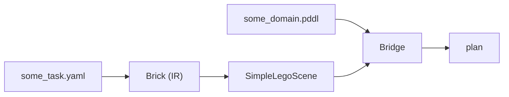

# Lego Workbenchmark


## Setup (TODO)

### TAMPanda

Install:
```bash
git clone https://github.com/snoato/TAMPanda.git
cd tampanda
pip install -e .
```
Now create symlink inside `src/`:
```bash
cd src
ln -s ../TAMPanda/tampanda .
```

### WorkBenchMark Dataset
In main repo folder (ie one folder level above src: `src\..`):
```bash
git clone https://github.com/WorkBenchMark/dataset.git
```
Now create symlink inside `src/`:
```bash
cd src
ln -s ../dataset .
```

### Lego Simulator (optional)
```bash
git clone https://github.com/ma-haha-hehe/lego_sim.git
```

### Fast-Downward (optional)
```bash
git clone https://github.com/aibasel/downward.git
cd downward
./build.py
```
Check whether `downward/fast-downward.py` exists.
To run solver, do
```bash
./<path-to-downwrad>/fast-downward.py path/to/pddl-domain.pddl path/to/problem.pddl --search "astar(blind())"
```

Example inside of `lego-workbenchmark`:
```bash
./downward/fast-downward.py src/domains/lego_coarse.pddl src/generated/problems_coarse/tier1/task_001.pddl --search "astar(blind())"
```


### Other
```bash
pip install pyyaml
```


---


## Project Structure (TODO)

### Overview


**For an example**, see this [notebook](src/lego_coarse_simple.ipynb).

### YAML Task Files
> see `src/dataset/ground_truth/tier[1,2]/task_*.yaml` 

Our input/problem: contains target structure and positions of a set of bricks.

### Brick
> see [src/yaml_loader.py](src/yaml_loader.py)

Internal representation of a brick in a specific yaml task (easier to work with than yaml dicts). Hence full yaml task is described by a list containing Brick objects.

### SimpleLegoScene
> see [src/scenes.py](src/scenes.py)

Sets up the [TAMPanda](https://github.com/snoato/TAMPanda) environment for a specific yaml task from its Brick representation. This involves adding the resources, putting the objects in their initial positions etc.
It also sets up the executor which allows us to control the arm in the TAMPanda environment (ie our env actions).

### PDDL Domains
> see `src/domains/*.pddl` 

Each domain defines a state space graph: set of states and actions (deterministic state transitions) which  are encoded via STRIPS:
- Defining objects of different types
- Possible relation types between those objects (predicates)
    - State is the current set of true relations
- Actions that change the current true relations
    - Hence actions transition to different states

### Bridge
> see [src/bridges.py](src/bridges.py)

Bridges 'link' the simulation environment (TAMPanda) to the symbolic state space graph (PDDL domain). They also build the goal condition (set of symbolic goal states).

As we want to plan in PDDL, we need to tell PDDL what our current asbtract symbolic state is from the TAMPanda environment (grounding).
From that state, PDDL gives us a plan (sequence of actions). Therefore we need to define what these abstract symbolic actions are actually supposed to do in the TAMPanda environment:
- state grounding (`bridge.predicate`): TAMPanda environment state to PDDL symbolic state
    - what relations hold between the objects
    - depends on what meaning you gave the predicates
    - or use `bridge.fluent` (initial value, then only changed by action effects => no re-sensing)
- action execution (` bridge.action` ): symbolic action to environment action
    - what is symbolic action supposed to do in real env


Let $s, s'$ be TAMPanda environemtn states and $t, t'$ PDDL symbolic states. Let *bridge* translate the symbolic action to a TAMPanda action and *ground* translate a TAMPanda state to a PDDL state:
```text

        a ────────── bridge ─────────▶ α


                       α
        s ───────────────────────────▶ s'
        │                              │
 ground │                              │ ground? (assumed)
        │                              │
        ▼                              ▼
        t ───────────────────────────▶ t'
                       a
```
We assume that after we execute an action $\alpha$ in our TAMPanda environment state $s$ that the new state we reach $s'$ still aligns with the symbolic state $t'$, but often that is not the case.
Eg when stacking a brick on a tower (the action being stack, the new state being the brick on the tower), the brick might slip while the symbolic state $t'$ represents a brick placed on a tower.
This is often solved with regrounding the state and replanning from there after each action execution.
